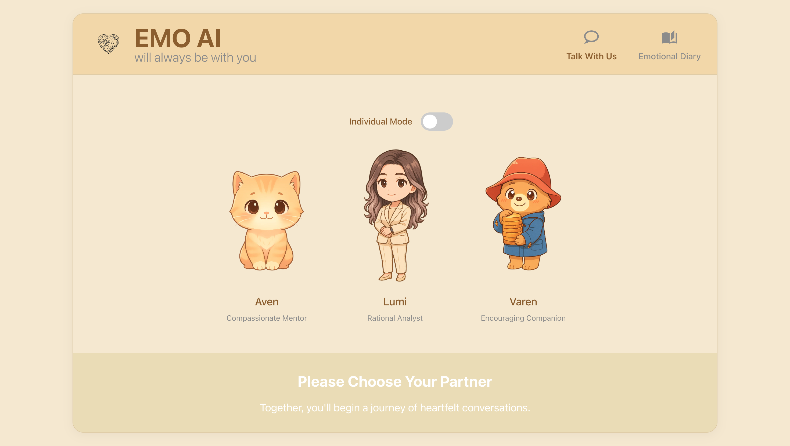
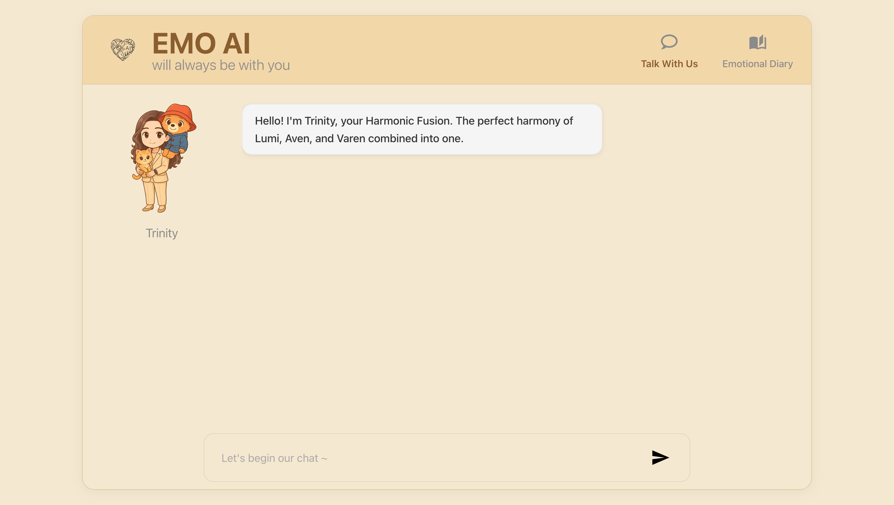
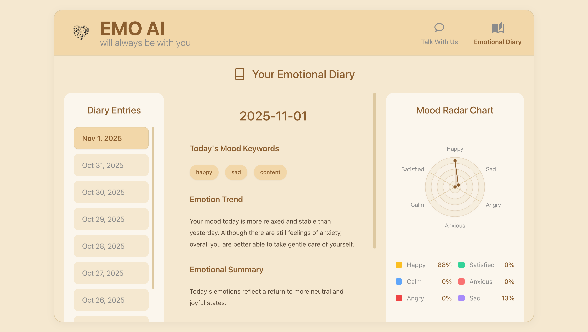

<div align="center">
  <!-- Replace with your logo -->
  
</div>

# EmoAI - Your Companion for Emotional Healing and Growth

**Production URL**: [https://app.emoai.co.uk/](https://app.emoai.co.uk/)

## Application Preview

| Main Page | Chat Interface | Emotion Diary |
| :---: | :---: | :---: |
|  |  |  |

## Project Overview

**EmoAI** is an AI Agent web application designed to provide emotional support, foster personal growth, and offer meaningful companionship. It utilizes advanced language models to embody different roles, engaging users in thoughtful conversations to help them explore their inner world, track emotional patterns, and find a safe, warm space for communication.

This project is organized into a frontend, a backend, and documentation, aiming to build a complete and scalable AI application.

## Key Features

*   **Dynamic Agent Selection**: Automatically chooses the most suitable AI personality (e.g., Counselor, Empath) based on the conversational context.
*   **Real-time Emotion & Intent Analysis**: Accurately identifies the user's emotions and intentions during the conversation to guide the AI's response.
*   **Streaming Text Responses**: Displays AI messages with a "typewriter" effect for a more natural and engaging interaction.
*   **RAG-Enhanced Knowledge**: Provides deeper, more accurate answers by integrating knowledge from external documents using Retrieval-Augmented Generation.
*   **Automated Emotion Diary**: Logs conversational emotion data and generates insightful daily and weekly reports for user self-reflection.
*   **Character Selection Gallery**: A visually rich interface for users to browse and choose their preferred AI companion.
*   **Adaptive AI Persona**: The AI's tone and style evolve in response to the user's emotional state throughout the dialogue.
*   **Modern & Responsive Interface**: A clean, intuitive, and fast user interface built with the latest web technologies for a seamless experience.

## Tech Stack

| Category      | Technology                                                                                                                                |
|---------------|-------------------------------------------------------------------------------------------------------------------------------------------|
| **Full Stack**  | [Nuxt.js](https://nuxt.com/) (Vue.js), [TypeScript](https://www.typescriptlang.org/), [Bun](https://bun.sh/), [Tailwind CSS](https://tailwindcss.com/) |
| **Server**    | [Nuxt Nitro](https://nitro.unjs.io/) (Serverless compatible)                                                                              |
| **AI/ML**     | `nvidia/llama-3.1-nemotron-nano-8b-v1` (Chat), `nvidia/llama-3.2-nv-embedqa-1b-v2` (RAG), OpenAI SDK (Client)                            |
| **Assets**    | Static assets managed in `/assets/`                                                                                                       |

## Project Structure

```
emoai-app/
├── src/             # Source code
│   ├── app.vue
│   ├── pages/       # Page components
│   └── components/  # Reusable components
├── server/          # Server-side logic (Nitro)
│   ├── api/         # API Endpoints
│   ├── utils/       # Shared utilities (Emotion, RAG, etc.)
│   └── data/        # Data persistence (Indexes, Logs)
├── nuxt.config.ts
├── package.json
├── docs/            # Project documentation
└── README.md        # The file you are currently reading
```

## Getting Started

### 1. Prerequisites

*   Ensure you have [Node.js](https://nodejs.org/) (v18+), [Bun](https://bun.sh/) installed.
*   Obtain an NVIDIA API key.

### 2. Setup & Run

```bash
# 1. Install dependencies
bun install

# 2. Configure Environment
# Create .env.local in the root directory and add:
# NVIDIA_API_KEY=your_key_here

# 3. Start the development server
# Similar to before, the app runs at http://localhost:3000
bun run dev
```

Now, you can open `http://localhost:3000` in your browser to access the EmoAI application.

## Contributing

Contributions to this project are welcome! If you have ideas, suggestions, or have found a bug, please feel free to open an Issue or submit a Pull Request.

## License

This project is open-source and licensed under the [MIT License](LICENSE).
